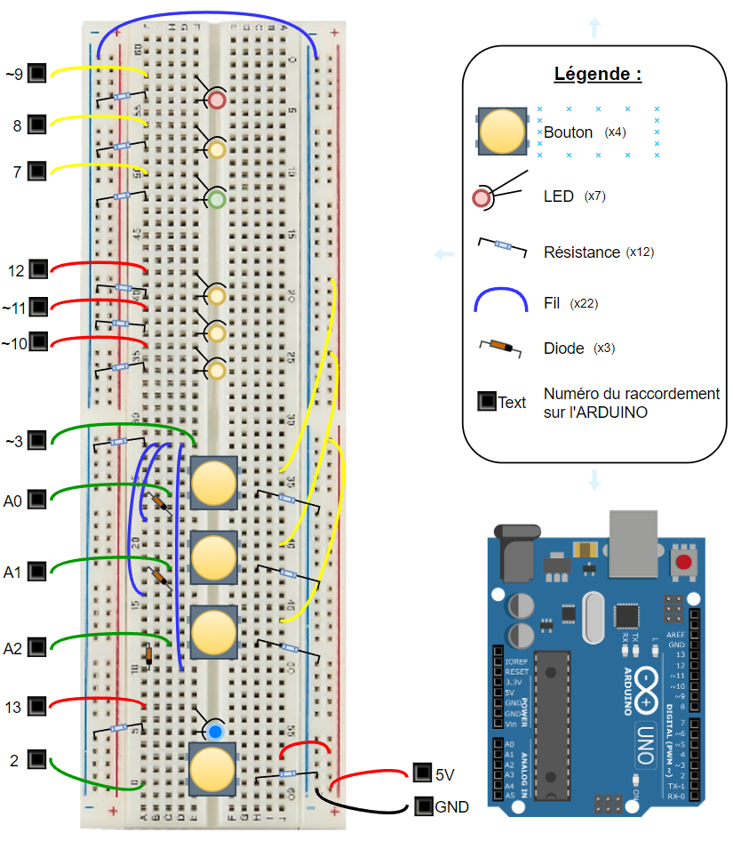
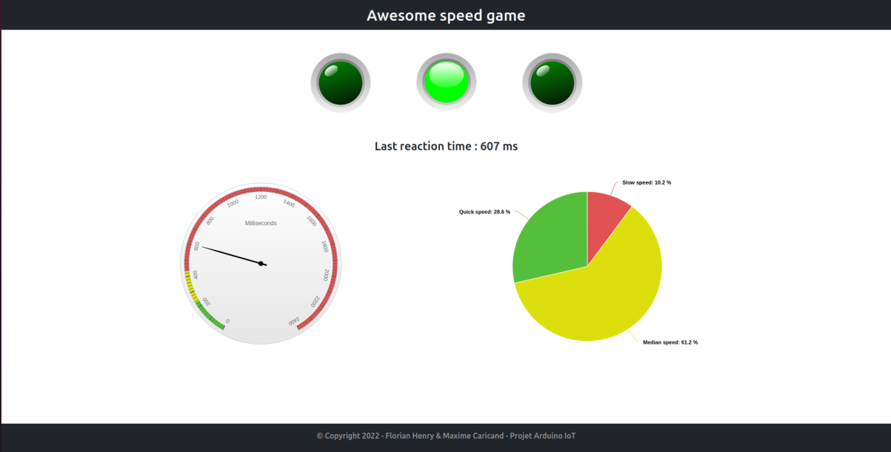
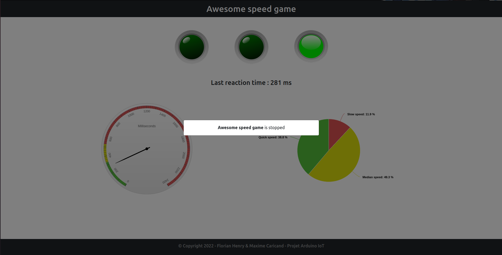

# Arduino_speed_game
- Education : M2 IWOCS
- Class : IOT
- TP : Project arduino

## Auteur(s)

|Firstname|Surname|login|email|
|--|--|--|--|
| Florian | HENRY | @hf171907 | florian.henry@etu.univ-lehavre.fr |
| Maxime | CARICAND | @cm171529 | maxime.caricand@etu.univ-lehavre.fr |

  

## Travail à réaliser

### Enoncé
_Ce TP est noté ! Les slides suivantes indiquent les éléments requis et facultatifs. 
L'objectif n'est pas d'avoir valider tous les éléments (sauf les requis, c'est mieux), mais d'avoir une solution fonctionnelle et avec peu de bugs ! 
À la fin, le projet (codes, ...) + une présentation orale de 5 minutes (idée et mini-mini-démo), comme dans un hackathon, = validation ou non._

 

### Eléments requis
- Projet sur Github/Gitlab (privée/publique), avec un accès pour l'enseignant
- Une interface web
- Une idée, même bidon, même fun
- Atteindre le niveau IOT ! (cf : <a href="http://servuc.github.io/teaching/iot-1.html">Cours</a>)
- Utiliser un/des gestionnaires de dépendances (Yarn/NPM/...)
- Architecture basée sur un docker-compose
- Design général agréable et responsive
- Une présentation agréable
- Choix techniques expliqués
- Bonne répartition des commits sur le repo. Git !
- Un README avec schéma, une LICENCE : Pourquoi ?
- Toutes les sources : Android, Arduino, Web, ...

 

### Eléments facultatifs
- Utiliser des technos récentes (cf : <a href="http://pigne.org/teaching/FullStackJS/">Cours de M. Pigne</a> et ...)
- Accompagner l'idée d'un business model (ne pas perdre plus de 2 minutes de réflexion dessus. Par exemple : Application avec pub, revente de données)
- Arriver à l'IOE (cf : <a href="http://servuc.github.io/teaching/iot-1.html">Cours</a>)
- Test unitaire (Vraiment facultatif car manque de temps !)

 

## Notre projet

_Pour comprendre les reférences aux LEDs et aux BOUTONS il faut regarder le schéma suivant :_

 

### Le projet choisit

Tout d'abord pour ce projet, nous avons choisi de réaliser un mini jeu interactif qui permet de faire travailler sa réactivité à l'aide l'arduino uno.

Ce jeu permet d'accroître l'attention et la réactivité de l'utilisateur. Le site fourni avec le jeu lui permettra de connaître ses performances et ainsi de les améliorer.

 

### Le but du jeu

Lorsque le jeu est lancé, au hasard, une des trois leds vertes au centre s'allume. Pour l'éteindre, il suffit d'appuyer sur le bouton qui lui correspond : bouton du bas, pour la led du bas, etc. Le but étant de l'éteindre le plus rapidement possible afin d'avoir un temps de réaction le plus bas. Celui-ci sera d'ailleurs affiché sur le site web à l'aide d'un accéléromètre et d'un graphique.

Sur ce jeu, nous avons :
 1. **4 boutons**
    - 1 bouton, pour lancer et éteindre le jeu (bouton situé en bas à coté de la LED bleu)
    - 3 boutons, sur lesquels nous devons appuyer pour éteindre les LEDs vertes le plus vite possible.

 2. **7 leds**
    - 1 led bleu, pour savoir si le jeu est en cours
    - 3 leds vertes, qui s'allument au hasard et qui s'éteignent lorsque l'on appuye sur le bouton
    - 3 leds verte, orange et rouge, qui permettent de nous dire si le temps de réaction est respectivement bon, moyen et long. Ce temps est calculé avec le temps de réaction moyen de l'utilisateur.

 

### L'interface utilisateur (site web)

L'interface est séparée en trois partie :
 1. En haut : le jeu en temps réel (la led qui s'allume sur le site est celle allumé sur l'arduino)
 2. Au milieu à gauche : un accéléromètre montrant le temps de réaction du joueur
 3. Au milieu à droite : un graphique permettant de voir le nombre de fois ou l'utilisateur a eu un temps de réaction rapide, moyen ou lent, selon la moyenne enregistrée.

**Voici-ci l'interface :**

Jeu en cours

Jeu en pause

 

## Les technologies et techniques utilisées

 1. **Arduino** :
    - Nous avons réalisé le jeu avec l'ensemble des équipements fournis par l'université : Arduino UNO, fils, leds, resistances, breadboard
    - L'Arduino UNO comptant uniquement 2 ports permettant les interrupts, nous avons due utiliser des diodes pour pouvoir récupérer les actions des 3 boutons centrales.
    - Pour envoyer les informations au serveur et en recevoir, nous avons utilisé le SerialPort.

 

 2. **Serveur/Client** :
    - Nodejs
    - TypeScript
    - Reactjs
    - Highcharts
    - Websocket

 

 3. **Docker** :
    - Mongodb
    - Client
    - Serveur

 

## Comment lancer le projet

Il faut au préalable avoir git, docker et arduino IDE.

Pour lancer le projet :

&nbsp;&nbsp;1.1. Clone le projet : https://github.com/MaximeCaricand/Arduino_speed_game.git  

&nbsp;&nbsp;2.1. Ouvrir Arduino IDE et sélectionner le code dans "**Arduino/code/**" 
&nbsp;&nbsp;2.2. Sélectionner le port "**/dev/ttyACM0**" 
&nbsp;&nbsp;2.3. Lancer le code pour l'ajouter à l'Arduino

&nbsp;&nbsp;3.1. Ouvrir le répertoire cloné 
&nbsp;&nbsp;3.2. Accéder au terminal et exécuter la commande "**docker-compose up**"

&nbsp;&nbsp;4.1. Rendez-vous sur l'url "**localhost:3000/**" 
&nbsp;&nbsp;4.2. TOUT EST PRET !